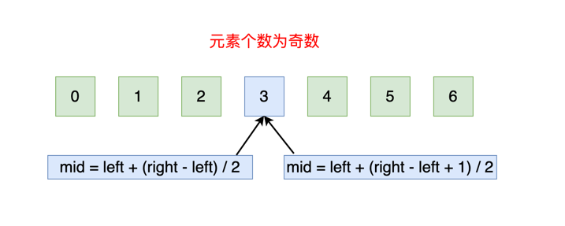
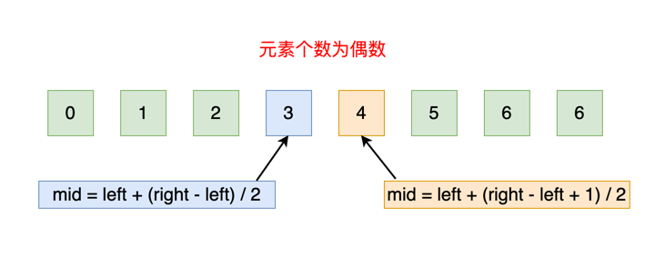

## 二分搜索
### 二分搜索的经典写法。需要注意的三点：
1. 循环退出条件，注意是 low <= high，而不是 low < high。
2. mid 的取值，mid := low + (high-low)>>1
3. low 和 high 的更新，low = mid + 1，high = mid - 1。

### 二分搜索的变种写法。有 4 个基本变种:
1. 查找第一个与 target 相等的元素，时间复杂度 O(logn)
2. 查找最后一个与 target 相等的元素，时间复杂度 O(logn)
3. 查找第一个大于等于 target 的元素，时间复杂度 O(logn)
4. 查找最后一个小于等于 target 的元素，时间复杂度 O(logn)

代码见traditional_binary文件

### 二分搜索需要考虑的细节
1. 区间的开闭问题：区间应该是左闭右闭区间 [left, right]，还是左闭右开区间 [left, right)？
2. mid 的取值问题：mid = left+(right-left)/2，还是 mid = left+(right-left+1)/2？
3. 出界条件的判断：left ≤ right，还是 left < right？
4. 搜索区间范围的选择：left = mid + 1、right = mid - 1、left = mid、right = mid 应该怎么写？

#### 1、区间的开闭问题
左闭右闭区间、左闭右开区间指的是：初始待查找区间的范围。

左闭右闭区间：
* 初始化时，left = 0，right = len(nums) - 1
* left 为数组第一个元素位置，right 为数组最后一个元素位置。
* 区间 [left, right] 左右边界上的点都能取到

左闭右开区间：
* 初始化时，left = 0，right = len(nums)
* left 为数组第一个元素位置，right 为数组最后一个元素的下一个位置
* 区间 [left, right) 左边界点能取到，而右边界上的点不能取到

结论： 关于二分查找算法的左闭右闭区间、左闭右开区间，其实在网上都有对应的代码。但是相对来说，左闭右开区间这种写法在解决问题的过程中，会使得问题变得复杂，需要考虑的情况更多，所以不建议使用左闭右开区间这种写法，而是建议：全部使用「左闭右闭区间」这种写法。

#### 2、mid 的取值问题
在二分查找的实际问题中，最常见的 mid 取值公式有两个：
* mid = left + (right-left)/2
* mid = left + (right-left+1)/2

当待查找区间中的元素个数为奇数时，使用这两种取值公式取到的都是中间元素的下标位置，如下图：

当待查找区间中的元素个数为偶数时，使用 mid = left + (right-left)/2 取到的是中间靠左边元素的下标位置；使用 mid = left + (right-left+1)/2 取到的是中间靠右边元素的下标位置，如下图：

