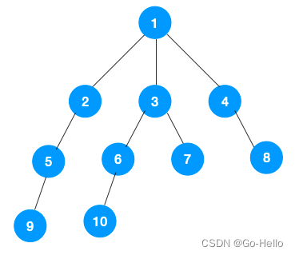
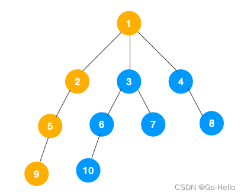
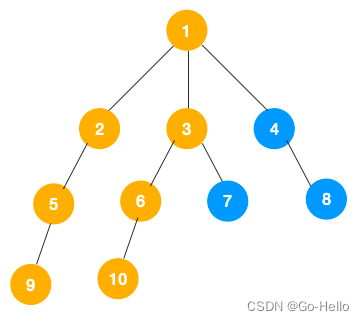
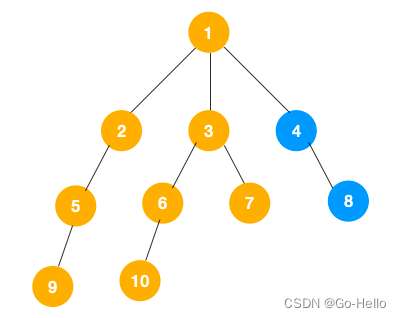
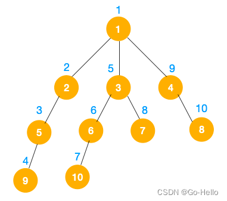

### 深度优先 - 递归实现
> 递归实现比较简单且容易理解，由于是前序遍历，所以我们只需要依次遍历当前节点、左节点和右节点即可，对于左节点再依次遍历他们的右节点即可。依次遍历下去，直到叶子节点（终止条件）。

> 看到以上的遍历不难发现这就是树的前序遍历,实际上不管是前序遍历，还是中序遍历，亦或是后序遍历，都属于深度优先搜索

### 深度优先 - 非递归实现
> 深度优先搜索的非递归实现是通过栈来实现的。
> 由于是先序遍历，所以我们先遍历当前节点，
> 然后把右节点压栈，再压左节点（这样弹栈的时候会先拿到左节点遍历，符合深度优先遍历要求）弹栈，拿到栈顶的节点，
> 如果节点不为空，重复步骤 ， 如果为空，结束遍历。

> * 一个节点出栈的同时，要分别将该节点对应的右节点、左节点 先后入栈
> * 从栈中再弹出一个元素，重复上边的操作